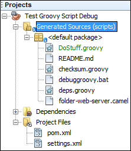
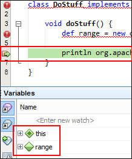

Debugging external Groovy scripts
=================================
You want to debug some Groovy script that your app runs, but the breakpoints you set fails with "Not able to submit breakpoint LineBreakpoint..."?

Here's how to make it work.

Prerequisite
------------
NetBeans IDE with these plugins installed:
- Maven
- Groovy and Grails

Usage instruction
-----------------
1. Download this project.
2. Open the downloaded project in NetBeans IDE.
3. Open `pom.xml` and replace `path/to/groovy/scripts/dir` with the location of the Groovy scripts used by your app (e.g. `c:/myapp/scripts`).
  - Observe that 'Generated Sources' folder will appear:

  
4. Open any Groovy script you need from 'Generated Sources' folder and set any line breakpoint you need.

When NetBeans' debugger is attached to your app, those breakpoints should now work:

